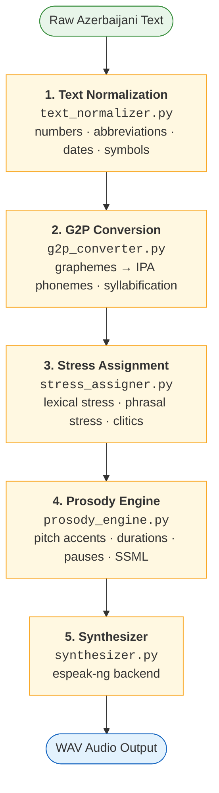
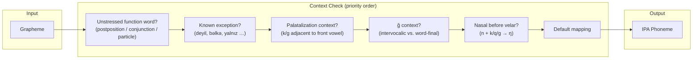
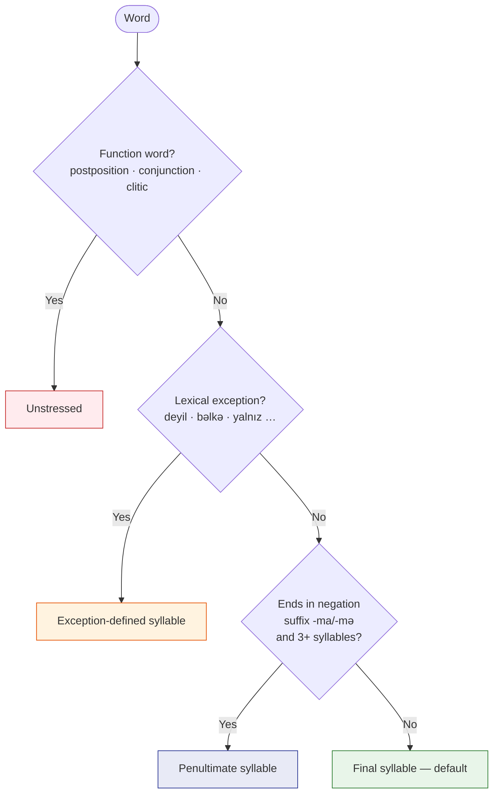
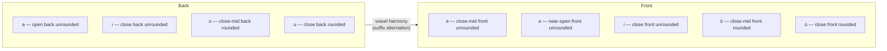
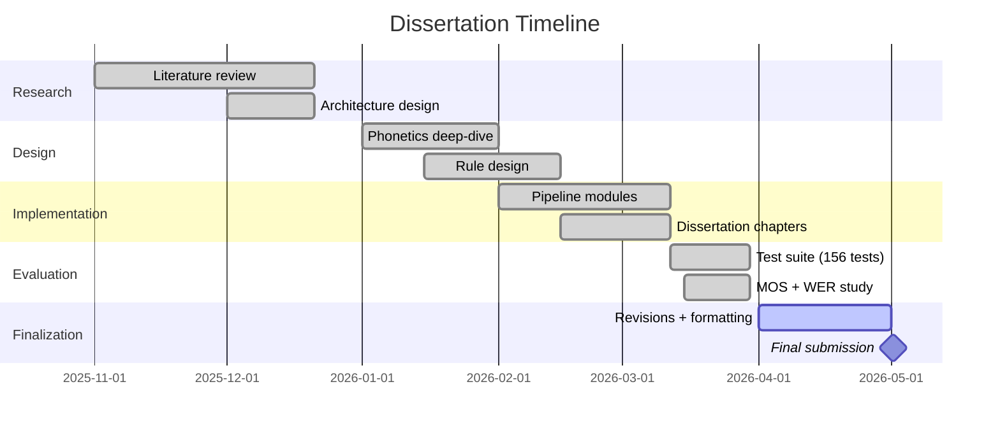

# Design and Development of a Rule-Based TTS System for Azerbaijani Language

- **Institution:** Azerbaijan State Economic University (UNEC)
- **Program:** MBA in Artificial Intelligence
- **Type:** Master's Dissertation
- **Mentor:** Khanim Pashayeva (pashayeva-khanim@outlook.com)

---

## Overview

A fully rule-based text-to-speech synthesis pipeline for **North Azerbaijani** (Latin script). The system requires no speech training data and converts raw Azerbaijani text to spoken audio through five sequential modules.

### Pipeline



---

## Live Demos

| Demo | Description | Link |
|------|-------------|------|
| **Rule-Based TTS** | Full pipeline — this dissertation's system (espeak-ng backend) | [tts-system-for-azerbaijani-language-1.onrender.com](https://tts-system-for-azerbaijani-language-1.onrender.com/) |
| **Azure Neural TTS** | Reference comparison — Microsoft Azure Cognitive Services (BanuNeural / BabekNeural) | [tts-system-for-azerbaijani-language.onrender.com](https://tts-system-for-azerbaijani-language.onrender.com/) |

> Both apps share the same UI. The rule-based demo runs the Python pipeline described in Chapter III. The Azure demo uses a cloud neural voice for perceptual comparison only.

---

## Key Results

| Metric | Proposed System | espeak-ng Baseline | Improvement |
|--------|:-:|:-:|:-:|
| **MOS** (naturalness, 1-5 scale) | **3.2** (std 0.5) | 2.8 (std 0.4) | +0.4 |
| **WER** (intelligibility) | **12.4%** (std 15.3%) | 18.7% (std 5.2%) | -6.3 pp |
| **G2P PER** (native vocabulary) | **2.8%** | — | — |
| **Sentence type detection** | **100%** (50/50) | — | — |
| **Text norm accuracy** | **97.5%** (118/121) | — | — |

> Evaluated on 50 phonetically balanced test sentences by 5 native Azerbaijani speakers.

---

## Linguistic Coverage

| Feature | Status | Details |
|---------|:------:|---------|
| 9-vowel system | done | a, e, ə, ı, i, o, ö, u, ü → IPA |
| Vowel harmony | done | Back/front suffix alternation |
| Palatalization (k/g) | done | /k/→/c/, /g/→/ɟ/ before front vowels |
| /ğ/ allophony | done | Intervocalic /ɣ/, word-final /ː/ |
| Final devoicing | done | b→p, d→t, z→s, g→k at word boundary |
| Nasal assimilation | done | /n/→/ŋ/ before velars, /n/→/m/ before bilabials |
| Geminate consonants | done | CC → Cː |
| Default final stress | done | With 8 exception categories |
| Sentence type detection | done | Declarative, YN-question, WH-question, exclamatory |
| Number-to-words | done | Cardinals, ordinals, vowel-harmony-correct suffixes |
| Date/time/abbreviation/currency | done | Full NSW normalization pipeline |

---

## Quick Start

**Requirements:** Python 3.10+ and [espeak-ng](https://github.com/espeak-ng/espeak-ng/releases)

```bash
# Install espeak-ng (Linux)
sudo apt install espeak-ng

cd 02_Technical/Code

# Run demo (10 test sentences covering key linguistic phenomena)
python -X utf8 main.py --demo

# Synthesize a sentence
python -X utf8 main.py "Azərbaycan gözəl ölkədir." --output out.wav

# Analyze pipeline stages without audio output
python -X utf8 main.py --analyze "Kitabı oxudunmu?"

# Interactive mode
python -X utf8 main.py --interactive
```

> On Windows, use `python -X utf8` to ensure correct Unicode handling in the terminal.

---

## Testing & Evaluation

```bash
cd 02_Technical/Code

# Run full test suite (156 tests)
pip install pytest
python -m pytest tests/ -v

# Run evaluation on 50 phonetically balanced sentences
python evaluation/run_evaluation.py

# Analyze MOS + WER data
python evaluation/analyze_results.py
```

### Test Suite Coverage

| Module | Tests | What is tested |
|--------|:-----:|----------------|
| `test_utils.py` | 22 | Character sets, vowel harmony, tokenization, WER/CER metrics |
| `test_text_normalizer.py` | 27 | Numbers, ordinals, Roman numerals, abbreviations, symbols, dates |
| `test_g2p_converter.py` | 29 | Vowel/consonant mapping, context rules, devoicing, syllabification |
| `test_stress_assigner.py` | 14 | Default stress, exceptions, phrasal stress, IPA rendering |
| `test_prosody_engine.py` | 30 | Sentence type detection, duration, pitch, pauses, SSML |
| `test_pipeline.py` | 34 | Full pipeline integration, all 50 test sentences end-to-end |
| **Total** | **156** | **All passing** |

---

## G2P Rule System



## Stress Rule Hierarchy



## Vowel System



---

## Repository Structure

```
├── 00_Planning/
│   ├── DEADLINES.md              # Timeline and milestones
│   ├── OUTLINE.md                # Dissertation structure + progress tracker
│   └── ROADMAP.md                # Phase-by-phase implementation plan
│
├── 01_Research/
│   ├── Documents/                # Reference theses and papers (PDF/DOCX)
│   ├── Images/                   # Screenshots and diagrams
│   ├── Notes/                    # Research notes
│   └── REFERENCES.md             # 40+ annotated references (APA 7)
│
├── 02_Technical/
│   ├── Code/
│   │   ├── main.py               # CLI entry point (demo, interactive, analyze)
│   │   ├── pipeline.py           # End-to-end orchestrator
│   │   ├── text_normalizer.py    # NSW → spoken form
│   │   ├── g2p_converter.py      # Graphemes → IPA phonemes
│   │   ├── stress_assigner.py    # Lexical & phrasal stress
│   │   ├── prosody_engine.py     # Pitch, duration, pauses, SSML
│   │   ├── synthesizer.py        # espeak-ng backend
│   │   ├── utils.py              # Shared utilities & metrics
│   │   ├── requirements.txt      # Dependencies
│   │   ├── pytest.ini            # Test configuration
│   │   ├── tests/                # 156 pytest tests (6 test files)
│   │   └── evaluation/           # 50 test sentences + MOS/WER data + scripts
│   └── Rules/
│       ├── g2p_rules.json        # Phoneme mappings & context rules
│       ├── text_norm_rules.json  # Number words, abbreviations, symbols
│       ├── stress_rules.json     # Stress patterns & exceptions
│       └── prosody_rules.json    # Intonation, duration, pause rules
│
├── 03_Dissertation/
│   ├── Abstract.md
│   ├── Introduction.md
│   ├── Chapter_1.md              # TTS overview — history, rule-based, pros/cons
│   ├── Chapter_2.md              # Azerbaijani phonetics, architecture, rule design
│   ├── Chapter_3.md              # Implementation, evaluation, results, conclusion
│   └── References.md             # APA 7 bibliography (40+ references)
│
└── 04_Archive/                   # Deprecated materials
```

---

## Project Timeline



---

## Planning & Tracking

- [DEADLINES.md](00_Planning/DEADLINES.md) — Timeline and milestones
- [OUTLINE.md](00_Planning/OUTLINE.md) — Dissertation structure and progress
- [ROADMAP.md](00_Planning/ROADMAP.md) — Phase-by-phase plan
- [REFERENCES.md](01_Research/REFERENCES.md) — Annotated bibliography
