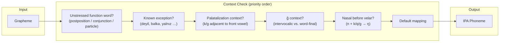
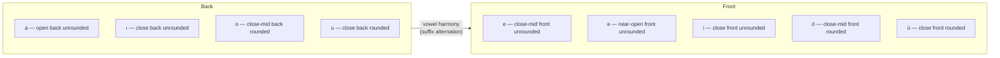
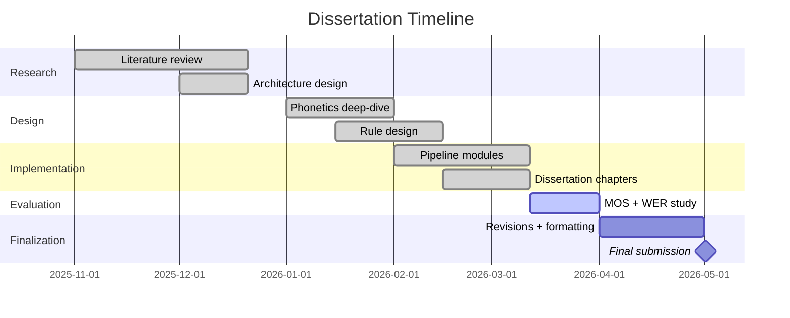

# Design and Development of a Rule-Based TTS System for Azerbaijani Language

- **Institution:** Azerbaijan State Economic University (UNEC)
- **Program:** MBA in Artificial Intelligence
- **Type:** Master's Dissertation
- **Target Length:** 51-75 pages
- **Citation Style:** APA 7
- **Mentor:** Khanim Pashayeva (pashayeva-khanim@outlook.com)

---

## Overview

A fully rule-based text-to-speech synthesis pipeline for **North Azerbaijani** (Latin script). The system requires no speech training data and converts raw Azerbaijani text to spoken audio through five sequential modules.

### Pipeline


### G2P Rule System



### Stress Rule Hierarchy


### Vowel System



---

## Quick Start

**Requirements:** Python 3.10+ and [espeak-ng](https://github.com/espeak-ng/espeak-ng/releases)

```bash
# Install espeak-ng (Linux)
sudo apt install espeak-ng

# Run demo (10 test sentences covering key linguistic phenomena)
cd 02_Technical/Code
python -X utf8 main.py --demo

# Synthesize a sentence
python -X utf8 main.py "Azərbaycan gözəl ölkədir." --output out.wav

# Analyze pipeline stages without audio output
python -X utf8 main.py --analyze "Kitabı oxudunmu?"

# Interactive mode
python -X utf8 main.py --interactive
```

> On Windows, use `python -X utf8` to ensure correct Unicode handling in the terminal.

---

## Repository Structure

```
├── 00_Planning/
│   ├── DEADLINES.md          # Timeline and milestones
│   ├── OUTLINE.md            # Dissertation structure + progress tracker
│   └── ROADMAP.md            # Phase-by-phase implementation plan
│
├── 01_Research/
│   ├── Documents/            # Reference theses and papers (PDF/DOCX)
│   ├── Images/               # Screenshots and diagrams
│   ├── Notes/                # Research notes
│   └── REFERENCES.md         # 40+ annotated references (APA 7)
│
├── 02_Technical/
│   ├── Code/
│   │   ├── main.py           # CLI entry point
│   │   ├── pipeline.py       # End-to-end orchestrator
│   │   ├── text_normalizer.py
│   │   ├── g2p_converter.py
│   │   ├── stress_assigner.py
│   │   ├── prosody_engine.py
│   │   ├── synthesizer.py
│   │   ├── utils.py
│   │   └── requirements.txt
│   └── Rules/
│       ├── g2p_rules.json
│       ├── text_norm_rules.json
│       ├── stress_rules.json
│       └── prosody_rules.json
│
├── 03_Dissertation/
│   ├── Abstract.md
│   ├── Introduction.md
│   ├── Chapter_1.md          # TTS overview — history, rule-based synthesis, pros/cons
│   ├── Chapter_2.md          # Azerbaijani phonetics, system architecture, rule design
│   ├── Chapter_3.md          # Implementation, evaluation methodology, results
│   └── References.md         # APA 7 bibliography
│
└── 04_Archive/               # Deprecated materials
```

---

## Linguistic Coverage

| Feature | Handled |
|---|---|
| 9-vowel system (a, e, ə, ı, i, o, ö, u, ü) | ✅ |
| Vowel harmony (back/front classes) | ✅ |
| Palatalization of /k/ and /g/ before front vowels | ✅ |
| /ğ/ allophony (intervocalic → /ɣ/, word-final → /ː/) | ✅ |
| Final obstruent devoicing | ✅ |
| Nasal assimilation (/n/ → /ŋ/ before velars) | ✅ |
| Geminate consonants | ✅ |
| Default final-syllable stress | ✅ |
| Stress exceptions (deyil, -ma/-mə, particles, postpositions) | ✅ |
| Sentence type detection (declarative, YN-question, WH-question, exclamatory) | ✅ |
| Number-to-words (cardinal, ordinal, vowel-harmony-correct suffixes) | ✅ |
| Dates, times, abbreviations, currency, unit symbols | ✅ |

---

## Project Status



---

## Planning & Tracking

- [DEADLINES.md](00_Planning/DEADLINES.md) — Timeline and milestones
- [OUTLINE.md](00_Planning/OUTLINE.md) — Dissertation structure and progress
- [ROADMAP.md](00_Planning/ROADMAP.md) — Phase-by-phase plan
- [REFERENCES.md](01_Research/REFERENCES.md) — Annotated bibliography
